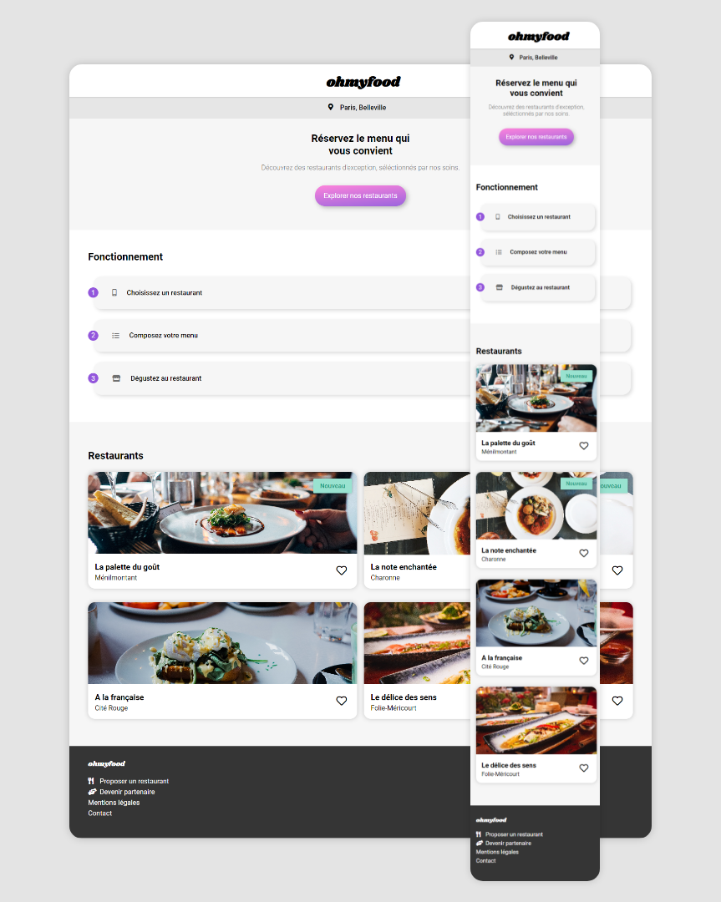

# Ohmyfood - Site de réservation de restaurant
Créer une maquette responsive, en suivant un modèle préétabli.

[Lien vers la maquette](https://0k00.github.io/QuentinDouvillez_3_17122020/)

## Outils

- HTML
- CSS
- SASS

## Aperçu

